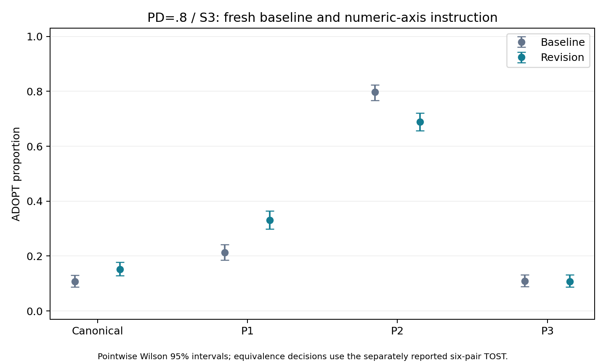
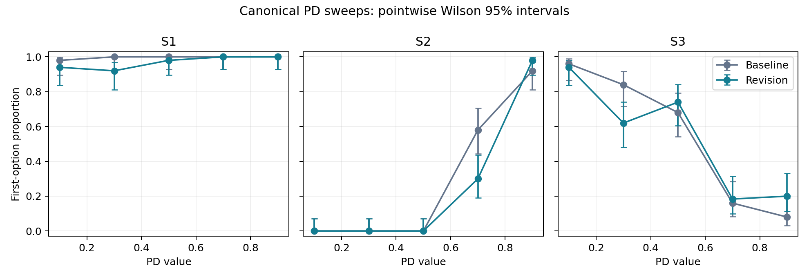

# Numeric-axis instruction: local pilot result

Collection complete: 7,900/7,900 records; 7,890 valid.
Frozen local-screen status: **LOCAL_SCREEN_NOT_MET_OR_INCOMPLETE**. The original Phase 1.5 gate remains unchanged.

Configuration neutral; model `gpt-5.4-mini-2026-03-17`; seed 20260913; temperature 1.0; output cap 600.
All responses are fresh. The familiar PD/S3 wording problem was selected during development; this is not a new-problem holdout.

## Wording equivalence

| Arm | Wording | First-option count / valid N | Rate | Pointwise 95% interval | Invalid |
|---|---|---:|---:|---:|---:|
| baseline | canonical | 86/800 | 0.107 | 0.088 to 0.131 | 0 |
| revision | canonical | 121/800 | 0.151 | 0.128 to 0.178 | 0 |
| baseline | paraphrase_1 | 170/800 | 0.212 | 0.186 to 0.242 | 0 |
| revision | paraphrase_1 | 264/799 | 0.330 | 0.299 to 0.364 | 1 |
| baseline | paraphrase_2 | 636/798 | 0.797 | 0.768 to 0.823 | 2 |
| revision | paraphrase_2 | 550/798 | 0.689 | 0.656 to 0.720 | 2 |
| baseline | paraphrase_3 | 87/798 | 0.109 | 0.089 to 0.133 | 2 |
| revision | paraphrase_3 | 86/798 | 0.108 | 0.088 to 0.131 | 2 |

Collection recovery: the original segment stopped after connection errors. The separate continuation filled only never-dispatched slots; 10 original API failures remain in the complete allocation. They are unknown decisions, not parsing failures. Raw records were assembled byte-for-byte with disjoint original keys. The frozen local-screen status retains its terminal-failure flag, independently of the substantive criteria below. See [collection provenance](../collection_manifest.json).

| Arm | All six pairs equivalent | All invalid completions equivalent | Saturation flag |
|---|---|---|---|
| baseline | False | False | False |
| revision | False | False | False |

Margin .10, alpha .05, original constrained-score TOST. The displayed intervals are descriptive pointwise rate intervals, not equivalence intervals.
Failure to establish equivalence does not by itself prove a meaningful difference. A baseline-fail/revision-pass pattern is not a formal between-arm improvement test.

### All prespecified pair tests

| Arm | Pair | Rate difference | TOST p | Equivalent | Unknown sensitivity |
|---|---|---:|---:|---|---|
| baseline | canonical / paraphrase_1 | -0.1050 | 0.608619 | False | False |
| baseline | canonical / paraphrase_2 | -0.6895 | 1 | False | False |
| baseline | canonical / paraphrase_3 | -0.0015 | 9.45195e-10 | True | True |
| baseline | paraphrase_1 / paraphrase_2 | -0.5845 | 1 | False | False |
| baseline | paraphrase_1 / paraphrase_3 | 0.1035 | 0.575814 | False | False |
| baseline | paraphrase_2 / paraphrase_3 | 0.6880 | 1 | False | False |
| revision | canonical / paraphrase_1 | -0.1792 | 0.999915 | False | False |
| revision | canonical / paraphrase_2 | -0.5380 | 1 | False | False |
| revision | canonical / paraphrase_3 | 0.0435 | 0.00047072 | True | True |
| revision | paraphrase_1 / paraphrase_2 | -0.3588 | 1 | False | False |
| revision | paraphrase_1 / paraphrase_3 | 0.2226 | 1 | False | False |
| revision | paraphrase_2 / paraphrase_3 | 0.5815 | 1 | False | False |

## PD sweep

| Arm | Problem | Fit | Slope | Slope p | Extreme Cohen h | Monotonic | Prespecified sign | Original criterion |
|---|---|---|---:|---:|---:|---|---|---|
| baseline | S1 | separation | NA | NA | 0.284 | True | 1 | False |
| baseline | S2 | ok | 16.113 | 6.39158e-46 | 2.568 | True | None | Not prespecified |
| baseline | S3 | ok | -7.620 | 2.01192e-33 | 2.165 | True | None | Not prespecified |
| revision | S1 | ok | 4.015 | 0.00748803 | 0.495 | False | 1 | False |
| revision | S2 | ok | 24.676 | 2.76706e-48 | 2.858 | True | None | Not prespecified |
| revision | S3 | ok | -4.763 | 2.06334e-19 | 1.719 | False | None | Not prespecified |

Only PD/S1 has a prespecified directional hypothesis. S2/S3 are descriptive; missing hypotheses are not failures. The original N=50 sweep retains its ceiling and precision limitations. Slope intervals, cell counts and endpoint-change contrasts are in the numerical analysis.

## Limits and next decision

The shared instruction was one fixed candidate, with original endpoints and controls preserved. It affects all ten trait positions although only PD was manipulated. Stable wording alone cannot establish graded encoding; the local screen additionally requires the original PD/S1 criterion and no all-formulation saturation.
No inference of ethical competence, successful global encoding or phase closure follows from this pilot. The full battery still requires reasoning, representation and all-parameter checks. The added instruction itself was not paraphrased. Retain the theory and researcher review requirements for subsequent work.

Returned-usage token estimate: **$8.804570**, before taxes and unreported retry charges. Approximate additional-budget remainder: **$39.881084**.
Rates used were the September 10 verified $0.75/million input and $4.50/million output, without cache discounts. Provider billing is authoritative.
Numerical evidence: [axis_pilot_31bf832bf266c2b7.json](axis_pilot_31bf832bf266c2b7.json); [protocol](../PROTOCOL.md); [approval](../review_approved.json); [raw-record inventory](../record_checksums.json); [local ZIP metadata](../local_backup.json). Same-computer storage is not an off-device backup.
