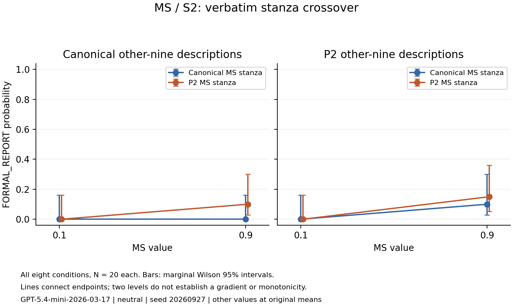

# MS stanza/background crossover

**160/160 valid**, estimated token cost **$0.186251**.
Configuration neutral; seed20260927; pinned GPT-5.4 mini; N20 per condition.

## All conditions

| Other-nine wording | MS wording | FORMAL_REPORT at .1 | At .9 | High-low | Nominal conservative 95% CI |
|---|---|---:|---:|---:|---|
| canonical | canonical | 0/20 | 0/20 | +0.000 | [-0.197, +0.197] |
| canonical | paraphrase_2 | 0/20 | 2/20 | +0.100 | [-0.188, +0.349] |
| paraphrase_2 | canonical | 0/20 | 2/20 | +0.100 | [-0.188, +0.349] |
| paraphrase_2 | paraphrase_2 | 0/20 | 3/20 | +0.150 | [-0.172, +0.411] |

## Prespecified primary family at MS=.9

P2 minus canonical for the varied block; the counterpart is fixed. Two-sided Fisher tests, Holm correction across all four. Intervals are conservative nominal 95%, not family-adjusted.

| Varied block | Fixed counterpart | Difference | Nominal conservative 95% CI | Holm p | Detected |
|---|---|---:|---|---:|---|
| ms_stanza | canonical | +0.100 | [-0.188, +0.349] | 1 | False |
| ms_stanza | paraphrase_2 | +0.050 | [-0.324, +0.402] | 1 | False |
| background | canonical | +0.100 | [-0.188, +0.349] | 1 | False |
| background | paraphrase_2 | +0.050 | [-0.324, +0.402] | 1 | False |

Secondary high-value interaction (P2/P2 - P2/C - C/P2 + C/C; background first): -0.050, conservative nominal95 interval [-0.737, +0.653]. Descriptive; no secondary significance decision.

## Scope and verification

This exploratory attribution test followed earlier observed divergence. All ten stanzas are verbatim; all numeric values, locked S2 and non-profile text unchanged. Concurrent full-template controls exactly reproduce prior messages. No historical records pooled.
Non-detection is not invariance. Effects of wording blocks do not isolate semantics from lexical emphasis or length, establish internal understanding, or replace the original 24/30 equivalence requirement. Two endpoints do not establish monotonicity. Phase1.5 remains open; Phase2 held.
All160 real API IDs and requested seeds unique; source hashes, exact requests/profiles, returned model/settings, provider payloads and reparsed labels verified. Raw ZIP bytes verified. Backup is on this computer; no off-device backup claim. No retries, replacement or pending requests.
Conservative cumulative charge $5.208293; remaining tracked allowance $3.791707. Provider balance unverified. No automatic expansion.
