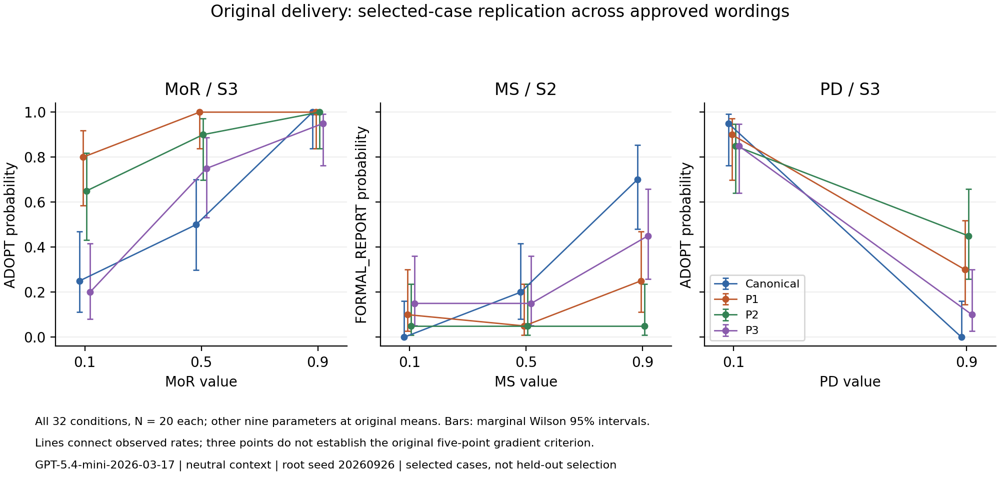

# Original-delivery selected-case replication

**640/640 valid calls**, cost **$0.710765**.
**4/8 directional endpoint comparisons** meet Holm-adjusted p<.05.
**0/48 wording pairs** establish a difference beyond .10 using simultaneous exact bounds.
These are different diagnostic counts; neither is the original 24/30 equivalence gate.

## Eight primary comparisons

| Case | Wording | Rates at .1 / .5 / .9 | High-low effect | Nominal conservative 95% CI | Holm p |
|---|---|---|---:|---|---:|
| MoR/S3 | canonical | 25% / 50% / 100% | +0.750 | [+0.281, +0.927] | 3.0834e-06 |
| MoR/S3 | paraphrase_1 | 80% / 100% / 100% | +0.200 | [-0.150, +0.469] | 0.16472 |
| MoR/S3 | paraphrase_2 | 65% / 90% / 100% | +0.350 | [-0.062, +0.622] | 0.02079 |
| MoR/S3 | paraphrase_3 | 20% / 75% / 95% | +0.750 | [+0.252, +0.953] | 7.7343e-06 |
| MS/S2 | canonical | 0% / 20% / 70% | +0.700 | [+0.230, +0.898] | 1.0021e-05 |
| MS/S2 | paraphrase_1 | 10% / 5% / 25% | +0.150 | [-0.276, +0.514] | 0.40748 |
| MS/S2 | paraphrase_2 | 5% / 5% / 5% | +0.000 | [-0.279, +0.279] | 0.75641 |
| MS/S2 | paraphrase_3 | 15% / 15% / 45% | +0.300 | [-0.204, +0.687] | 0.16472 |

Directions concern ADOPT for MoR/S3 and FORMAL_REPORT for MS/S2. Effect intervals are nominal across comparisons; Holm corrects the eight one-sided tests.

## Retained PD/S3 stress case

| Wording | ADOPT .1 | ADOPT .9 | High-low effect | Nominal conservative 95% CI |
|---|---:|---:|---:|---|
| canonical | 19/20 | 0/20 | -0.950 | [-0.999, -0.524] |
| paraphrase_1 | 18/20 | 6/20 | -0.600 | [-0.889, -0.078] |
| paraphrase_2 | 17/20 | 9/20 | -0.400 | [-0.768, +0.123] |
| paraphrase_3 | 17/20 | 2/20 | -0.750 | [-0.967, -0.240] |

No new directional PD hypothesis or significance claim is introduced.

## Gross wording differences

No gross discrepancy established at this precision. This does not establish equivalence.

All 48 contrasts, including non-detections and unknown-outcome bounds, are retained in the analysis JSON.

## Interpretation limits and verification

Selection used prior evidence: two responsive cases plus a known stress case. Fresh observations replicate selected effects, not the full architecture or unseen dilemmas. N20 and three levels do not replace the original five-level gradients or equivalence battery.
All ten parameters, original system-role delivery, approved wording, user prompts and labels retained. No baseline 50/50 or 70/30 requirement was added for profiled responses.
Positive endpoint effects do not establish internal understanding, wording equivalence, representation retention or active-trait recoverability. The original Phase1.5 gate remains unchanged; Phase2 is not authorised by this result.
All640 real API IDs and requested seeds unique; exact sources/messages/profiles, provider payload text and reparsed labels verified. Raw ZIP contents verified byte-for-byte; local backup remains on this computer. No retries, replacement, pooling or pending calls.
Conservative cumulative charge $5.022043; remaining allowance $3.977957. Provider balance unverified.
Model gpt-5.4-mini-2026-03-17; neutral; temperature1;max600;seed20260926. No automatic follow-up allocation.
