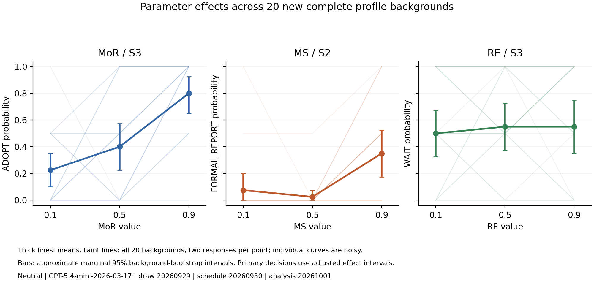

# Three-parameter profile transfer

**360/360 valid responses**, estimated token cost **$0.389088**.
20 sampled backgrounds x3 separate parameter interventions x3 levels x2 complete blocks. Neutral context; draw20260929, schedule20260930, analysis20261001.

## Three prespecified local comparisons

| Parameter / target | Counts at .1 / .5 / .9 (each/40) | High-low effect | Nominal95 interval | Adjusted98.333% interval | Block1 / block2 effects | Local support |
|---|---|---:|---|---|---|---|
| MoR / ADOPT | 9 / 16 / 32 | +0.575 | [+0.425,+0.725] | [+0.400,+0.750] | +0.600 / +0.550 | True |
| MS / FORMAL_REPORT | 3 / 1 / 14 | +0.275 | [+0.150,+0.425] | [+0.100,+0.450] | +0.350 / +0.200 | True |
| RE / WAIT | 20 / 22 / 22 | +0.050 | [-0.125,+0.250] | [-0.150,+0.275] | +0.200 / -0.100 | False |

50000 shared whole-background percentile resamples. Adjusted intervals use Bonferroni across three comparisons; coverage remains approximate with20 backgrounds. Local support requires adjusted lower bound>0 and positive effects in both blocks. No global architecture pass.

## All background effects

High-minus-low target probability, averaged across two blocks. Do not classify individual backgrounds as reliable passes/fails from two responses per level.

| Background | MoR ADOPT | MS FORMAL_REPORT | RE WAIT |
|---|---:|---:|---:|
| 00 | +0.50 | +0.00 | +0.00 |
| 01 | +1.00 | +0.00 | +1.00 |
| 02 | +0.50 | +0.00 | +0.00 |
| 03 | +1.00 | +0.00 | -0.50 |
| 04 | +0.50 | +0.50 | +0.00 |
| 05 | +0.50 | +0.00 | +0.50 |
| 06 | +0.00 | +0.50 | +0.00 |
| 07 | +1.00 | +1.00 | +0.00 |
| 08 | +0.50 | +0.50 | +0.00 |
| 09 | +0.50 | +0.00 | +0.00 |
| 10 | +0.50 | +0.00 | +1.00 |
| 11 | +0.50 | +0.00 | +0.00 |
| 12 | +1.00 | +1.00 | -0.50 |
| 13 | +0.50 | +0.00 | -0.50 |
| 14 | +0.00 | +0.50 | +0.00 |
| 15 | +1.00 | +0.00 | +0.00 |
| 16 | +0.50 | +0.00 | +0.50 |
| 17 | +0.50 | +0.50 | +0.00 |
| 18 | +1.00 | +0.50 | +0.00 |
| 19 | +0.00 | +0.50 | -0.50 |

## Scope and provenance

All20 backgrounds retained, with unchanged Beta/R sampling. Copies intervene on one coordinate and are not unmodified joint-population draws. Other nine coordinates remain fixed within each triplet. The three coordinates are tested separately; interactions are not identified.
Source definitions, non-profile text and locked S2/S3 user messages match exactly. No answer targets are injected. RE is scored toward WAIT under its original hypothesis; ADOPT remains the first literal option in S3.
All360 provider IDs and request seeds unique; no retries, missing outcomes or unresolved requests. Source hashes, exact messages/profiles/labels/parses and raw ZIP bytes verified. All20 sampled profiles reproduced from the fixed seed. Local archive is on this computer, not off-device storage.
No historical outcomes pooled. Cases were selected from development evidence. Fixed wording and familiar dilemmas limit transfer claims. Three levels do not replace five-point gradients; midpoint order is descriptive. No interpretation/recovery, paraphrase or representation gate is passed by this result alone. Phase1.5 remains open and Phase2 held.
Remaining tracked allowance **$3.357386**; provider balance unverified. No automatic additional calls.
